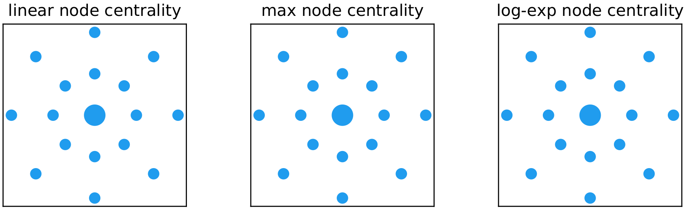
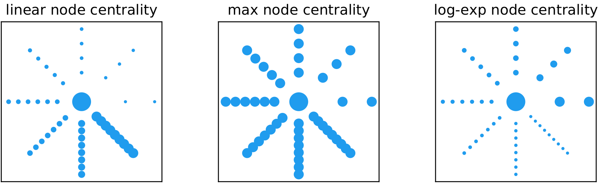

# Higher-order network models

While graph and networks are ubiquitous in the natural sciences, in many real-world applications we  are confronted with higher-order interaction data. Relational data is full of interactions that happen in groups. For example, friendship relations very often happen in groups that are strictly larger than two individuals.  Moreover, interactions naturally occur on multiple layers, for example  work relations, sport relations, friendship relations, etc.  

To model higher-order interactions we need higher-order network models, which include *multilayer networks*,  where we have a set of networks (so-called layers) with connections internally  and  across the layers, and *non-dyadic networks*, such as hypergraphs or simplicial complexes, where we have access to interactions involving multiple nodes. 


For simplicity, here we consider the following two settings:  

- **Multiplex**: This is a set $\{G_i\}$ of $m$ graphs $G_i=(V,E_i)$ $i=1,\dots,m$, the *layers*, each defined on the same set of nodes but with possibly different edge sets 
- **Hypergraph**: Just like a standard graph, this is a pair $H=(V,\mathcal E)$ where the set of *hyperedges* $\mathcal E$ is such that each $e\in \mathcal E$ can involve an arbitrary number of nodes, rather than just two nodes as in the standard graph case. 

<!-- Here we focus on the hypergraph setting, where  interactions across multiple nodes are described by a hypergraph $H=(V,E)$, made by a set of nodes $V=\{1,\dots,n\}$ and a set of hyperedges $E$ where each $e\in E$ can involve an arbitrary number of nodes, rather than just two nodes as in the standard graph case.  -->

<!-- <center>

</center> -->


## Eigenvector centrality for multiplex 
A multiplex network $\{G_k\}$ can be naturally described by means of an adjacency tensor $T$ with three modes

$$
T_{ijk} = \begin{cases}
1 & i\to j \text{ on layer }k \\
0 & \text{otherwise}
\end{cases}
$$ 

where  $i\to j$ means that there is an edge from node $i$ to node $j$, i.e. $(i,j)\in E_k$. 

How can we define a mutual reinforcing centrality score for nodes (and layers) in $\{G_k\}$ so that a larger  centrality is assigned to nodes that form  links  with other central nodes in  highly  influential  layers? Here we discuss the model proposed in [@tudisco2017node] based on $T$ and a multihomogeneous order-preserving mapping associated to it.  Other approaches are discussed in [#Related work](#related-work). 

In this model, mutual reinforcement happens at both layer and node levels, as layers are more influential if highly central nodes are active in them. Thus, if $x_i$ denotes the centrality of node $i$ and $y_k$ the influence of layer $k$, we require that 

\begin{equation}\label{eq:tensor_singvec}
\left\{
\begin{array}{l}
    \sum_{j,k}T_{i,j,k}x_jy_k = \lambda \, |x_i|^{p} \mathrm{sign}(x_i)\\[.5em] \sum_{i,j}T_{i,j,k}x_ix_j = \mu\,   |y_k|^{q} \mathrm{sign}(y_k)
\end{array}
\right.
\end{equation}

which imposes that the $p$-power of the importance of node $i$ is proportional to the sum of the importances of the nodes that point at $i$, times the influence of the layer where such connections take place and, similarly, defines the $q$-power of the influence of the layer $k$ as being proportional the product of the centrality of the nodes that are connected in that layer. 

<!-- $$x_i \propto \sum_{jk}\mathcal A_{ijk}x_jy_k \quad  \text{ and } \quad y_k \propto \sum_{ij}\mathcal A_{ijk}x_ix_j$$ -->


Since the centrality score is a positive number it is natural to add the constraint $\lambda,\mu>0$ and $x,y\succ 0$ in $\eqref{eq:tensor_singvec}$. Thus, our centrality problem boils down to a constrained nonlinear system of equations. When $p=q=1$, the equations are homogeneous polynomials and $\eqref{eq:tensor_singvec}$ is directly reminiscent of a singular vector equation. However, unlike the matrix case, even positive tensors may admit multiple solutions here, as shown by the following example:
<!-- ###### A entrywise positive 2x2x2 example -->

<section markdown="block" class="example">
Consider the positive adjacency tensor $T$ with entries 

$$
\left\{
\begin{array}{llll} 
T_{1,1,1} = 6 & T_{1,2,1} = 199/7 & T_{2,1,1} = 16/7 & T_{2,2,1} = 11 \\ 
T_{1,1,2} = 61/7 &  T_{1,2,2} = 6 & T_{2,1,2} = 29 & T_{2,2,2} = 16/7
\end{array}\right.
$$

then both the pair $x = \frac 1 3(2,1)$, $y = \frac 1 3(1,2)$ and the pair $x = \frac 1 4(1,3)$,  $y  = \frac 1 4(3,1)$ are positive solutions to $\eqref{eq:tensor_singvec}$.
</section>


In order to practically use the centrality model $\eqref{eq:tensor_singvec}$ we need it to define a unique score. To this end, we recast the vectors $x,y$ solutions of $\eqref{eq:tensor_singvec}$ as eigenvectors of the multihomogeneous mapping

$$
F(x,y) := \begin{bmatrix} F_1(x,y) \\ F_2(x,y) \end{bmatrix} =  \begin{bmatrix} (T_{(1)}xy)^{1/p} \\ (T_{(3)}xx)^{1/q} \end{bmatrix} = \begin{bmatrix} (\sum_{jk} T_{ijk}  x_jy_k)^{1/p} \\ (\sum_{ij}T_{ijk}x_ix_j)^{1/q} \end{bmatrix}\, .
$$

In fact, it is easy to see that $\eqref{eq:tensor_singvec}$ holds iff $F(x,y)= (\lambda,\mu)\krog  (x,y)$. Moreover, one easily realizes that 

$$
\M = \begin{bmatrix}
1/p & 1/p \\ 2/q & 0
\end{bmatrix}
$$

is the homogeneity matrix of $F$. Thus, using a slightly different cone than $C_+$, one obtains the following:


<!-- Let $\mathcal C = C_+^1\times \dots \times C_+^m$, $x = (x^{(1)}, \dots, x^{(m)}) \in \mathcal C$  -->


<section markdown="block" class="theorem">
**Theorem.** Let $n$ and $\ell$ be the number of nodes and the number of layers in $\{G_k\}$, respectively. Consider the following set of pairs of vectors

\[
C_+(T) =\left\{(x,y)\succeq 0  \quad : \quad 
\begin{array}{c}
 x_i \propto   \textstyle{\sum_{j,k} T_{ijk}}, \quad \forall i = 1, \dots, n\\
 y_k \propto \textstyle{\sum_{i,j} T_{ijk}}, \quad \forall k =1,\dots, \ell
\end{array}\right\}\, .
\]

This is a cone of vectors that depends on the nonzero pattern of $T$: for $(x,y)\in C_+(T)$, $x_i$ is zero if and only if $T_{ijk}=0$ for all $j,k$, that is node $i$ is isolated in all the layers and, similarly, $y_k=0$ if and only if layer $k$ is empty (there is no edge in that layer).  


Then $\rho(\M) =  ( \sqrt{8p+q}+\sqrt{q}) / (2p\sqrt{q})$ and if $\rho(\M)<1$ we have:

**1.** The system of nonlinear equations $\eqref{eq:tensor_singvec}$ has a unique solution $(x^*,y^*)\in C_+(T)$ such that $\|x^*\|=\|y^*\|=1$. 

**2.** The power method iteration
``` julia
x = ones(n,1) 
y = ones(l,1)
for r = 0,1,2,3,..
        x = F_1(x,y)
        x = x / norm(x)
        y = F_2(x,y)
        y = y / norm(y)
```
converges to $(x^*,y^*)$ and after $m$ steps we have 

$$
\|(x,y)-(x^*,y^*)\|_{\infty} \leq \rho(\M)^m \Big\{ \rho(\M) \, p\, \frac{\max_{i\in\mathcal I} x_i^*}{\min_{i'\in\mathcal I} x_{i'}^*}+\, \frac{\max_{k\in\mathcal J} y_k^*}{\min_{k'\in\mathcal J} y_{k'}^*}\Big\}
$$

with  $\mathcal I=\{i \, : \, x^{*}_i>0\}$ and $\mathcal J =\{k \, :\, y_k^{*}>0\}$.
 
</section>


### Related work 
Other models for eigenvector centrality on multiplex networks are available. 
Many of them are based on a "flattening" or "projection" approach which essentially transforms the multiplex into a graph and uses matrix eigenvectors on that graph to model node importances. These include, the aggregated graph of a multiplex graph [@sola2013eigenvector] [@battiston2014structural] [@zhou2007spectral] [@tsuda2005fast], where multiple layers with adjacency matrices $A_1,\dots, A_m$ are aggregated via a linear (possibly weighted) combination into a single denser  adjacency matrix $A_{\mathrm{agg}} = w_1A_1 + \dots + w_mA_m$;  the supra-adjacency graph of a multilayer graph [@de2013centrality] [@taylor2017eigenvector] [@taylor2021tunable], where a new graph  of larger size is built by taking the Cartesian product of all the layers with weighted layer couplings obtaining a large adjacency matrix   of the form

$$A_{\mathrm{supra}}=
\begin{bmatrix}
A_1 & I & \dots  & I \\
I & \ddots & \ddots &\vdots  \\
\vdots &  \ddots & \ddots & I \\
I & \dots & I & A_m
\end{bmatrix}
$$

Once a standard graph is obtained from the multiplex data, standard techniques can be applied to define and compute mutual-reinforcing centralities. In particular, the classical Perron--Frobenius theory for matrices can be directly applied to the flattened graphs. To this end, it is interesting to notice that 

<!-- <section markdown="block" class="definition"> -->

$$
A_{\mathrm{supra}} \text{  is irreducible } \iff A_{\mathrm{agg}} \text{ is irreducbile}
$$ 

<!-- </section> -->

A different approach is proposed in [@rahmede2018centralities] where the centrality for nodes and layers is computed by summing up powers of entries of the incidence matrix of the multiplex. 


## Nonlinear eigenvector centrality for hypergraphs 

A hypergraph $H=(V,E)$ consists of a set of nodes $V$ and a set of hyperedges $E$, but, unlike graphs, an hyperedge $e\in E$ can contain an arbitrary number of nodes. In the weighted setting, we assume a weight function $w:E\to \RR_+$ that assigns the weight $w(e)>0$ to each hyperedge. 

Also in this setting, a relatively standard way to extend graph mappings and their eigenvectors is via a "flattening" or a "projection". These are forms of linearizations where the whole hypergraph is flattened into a standard graph to which standard centrality models are applied.  There are many approaches that follow this line, including linear-weighted clique expansions [@carletti2020random] [@rodri2002laplacian] [@rodriguez2003laplacian] [@rodriguez2009laplacian] [@agarwal2006higher] [@zhou2007hypergraph]  where hyperedges are replaced by cliques in the flattened graph, whose adjacency matrix becomes 

\begin{equation}\label{eq:clique-expansion-adjacency}
    A_{ij} = \sum_{e: \, i,j\in e}w(e) 
\end{equation}

with $w(e)$ the weights of the original hypergraph; clique averaging  [@agarwal2005beyond], where  the weights $w(e)$ in the sum $\eqref{eq:clique-expansion-adjacency}$  are averaged with generalized mean functions;  connectivity graph expansion [@banerjee2021spectrum] [@de2021phase], where the weights in the clique expansion are based on hyperedge degrees, for example replacing $w(e)$ with $1/(|e|-1)$ in $\eqref{eq:clique-expansion-adjacency}$; the  star expansion  [@zien1999multilevel], where the flattened graph is obtained by introducing new vertices for each hyperedge, which are then connected according to the hypergraph structure. 


Another popular approach for centrality on hypergraphs uses a  tensor representation of the data and tensor  eigenvectors. 
This is a particularly natural approach in the case of uniform hypergraphs. A $m$-uniform hypergraph is a hypergraph $H=(V,E)$ such that each hyperedge $e\in E$ contains exactly $m$ nodes. Thus, a $2$-uniform hypergraph is a standard graph. As every hyperedge contains exactly $m$ nodes, we can associate to $H$ the adjacency tensor  $T$ such that $T_{i_1,\dots,i_m} = w(e)$ if the hyperedge $e = \{i_1,\dots,i_m\}\in E$, and $T_{i_1,\dots,i_m}=0$ otherwise. Clearly, $T$ coincides with the adjacency matrix of the graph when $m=2$. 

A centrality score $x_i$ for the node $i\in V$   of a $m$-uniform hypergraph  is defined in [@benson2019three] as being linearly proportional to the product of the centrality scores of the nodes in each hyperedge that involves $i$. This mutual reinforcing relation boils down to the constrained eigenvector equation

\begin{equation}\label{eq:tensor_eig}
    \sum_{i_2,\dots,i_k}T_{i,i_2,\dots,i_m}x_{i_2}x_{i_3}\cdots x_{i_m} = \lambda \, |x_{i}|^{p-2}x_{i} 
\end{equation}

with $x>0$, $\lambda>0$ and $p>1$.
The special cases $p=2$ and $p={m}$ correspond to so-called $Z$- and $H$-eigenvectors for $T$. 


### Beyond matrices and tensors

Matrix and tensor eigenvector approaches are constrained to model the interaction of nodes at higher-order and across layers as either an additive  or a multiplicative function. 
For example, in $\eqref{eq:tensor_eig}$ the importance $x_i$ of node $i$ is inherited by the **product** of the importances of the nodes on each hyperedge node $i$ belongs to.  Moreover, tensor representations seem inadequate to model general hypergraphs as they require a constant number of nodes in the hyperedges. 

We discuss below a model introduced in [@tudisco2021nodeandedge], based on the incidence matrix of the hypergraph and a general nonlinear multihomogeneous mapping. 

If $n=|V|$ and $m = |E|$, the *incidence matrix* and the *diagonal weight matrix* of $H$ are $n\times m$ and the $m\times m$ matrices defined respectively as 

$$
B_{i,e} = 
\begin{cases}
1 & i\in e \\
0 & \text{otherwise }
\end{cases} \qquad W = \begin{bmatrix} w(e_1) & & \\ & \ddots & \\ & & w(e_m)\end{bmatrix}\, .
$$

These matrices fully describe  the hypergraph. For example, when each $e$ has size exactly 2, i.e. we are considering a standard graph, then $BWB^\top = A + D$ where $A$ is the adjacency matrix of $H$ and $D = \mathrm{Diag}(d_1, \dots, d_n)$ is the digonal matrix of the weighted node degrees $d_i = \sum_{j}A_{ij}$.
Similarly, for a general hypergraph $H$, we have $BWB^\top = A+D$ where $A$ and $D$ this time are the adjacency and degree matrices of the clique-expansion graph associated with $H$, as defined in $\eqref{eq:clique-expansion-adjacency}$. 
However, unlike the clique-expanded adjacency matrix, $B$ allows us to model the structure of $H$ "before" the flattening step. 
This is the basis of the model below where we describe a spectral (thus mutually reinforcing) model for both  nodes and edges of a hypergraph. 

Let $x$ and  $y$ be nonnegative vectors whose entries will provide centrality scores for the nodes and 
hyperedges of $H$, respectively. We would like the importance $y_e$ for an edge $e\in E$ to be a nonnegative number proportional to a function of  the importances of the nodes in $e$, for example  $y_e \propto \sum_{i\in e} x_i$. Similarly, we require that the centrality $x_i$ of node $i\in V$ is a nonnegative number proportional 
to a function of the importances of the edges it participates in, for example $x_i \propto \sum_{e: i\in e}w(e)y_e$. As the centralities $x_i$ and $y_e$ are all nonnegative, these sums coincide with the weighted $\ell^1$ norm of specific sets of centrality scores. Thus, we can generalize this idea by considering the weighted $\ell^p$ norm of node and edge importances. This leads to 

$$
x_i \propto \Big(\sum_{e: i\in e}w(e)y_e^p\Big)^{1/p},\qquad y_e \propto \Big(\sum_{i\in e} x_i^q\Big)^{1/q},  
$$

for some $p,q\geq 1$. More generally, we can consider four functions $f,g,\varphi,\psi:\RR_+\to\RR_+$ of the nonnegative real line   and require that 

$$
x_i \propto g\Big(\sum_{e: i\in e}w(e)f(y_e)\Big),\qquad y_e \propto \psi\Big(\sum_{i\in e}\nu(i)\varphi(x_i)\Big)  \, .
$$

If we extend real functions on vectors by defining them as mappings that act in a componentwise fashion, the previous relations can be compactly written as the following constrained nonlinear  equations

\begin{equation}\label{eq:NEP}
    \begin{cases}
    \lambda x = g\big(BW f(y)\big) & \\
    \mu  y = \psi\big(B^\top   \varphi(x)\big)
    \end{cases}\qquad   x,  y \succ  0, \quad  \lambda, \mu > 0  \, .
\end{equation}

Particular choices of the functions $f,g,\psi$ and $\varphi$ allow us to retrieve different models. 

If $f,g,\psi$ and $\varphi$ are all identity functions, then $\eqref{eq:NEP}$ boils down to a linear system of equations which is structurally reminiscent of the  HITS  centrality model for directed graphs, briefly reviewed above: the importance of a node is proportional to the sum of the importances of the hyperedges it belongs to and, vice-versa, the importancesof a hyperdge is proportional  to the sum of the importances of the nodes it involves.

When $f,g,\psi$ and $\varphi$ are logarithmic- and exponential-based, instead, the nonlinear eigenvector equation $\eqref{eq:NEP}$ allow us to extend the tensor eigenvector centrality model to the non-uniform hypergraph setting. In fact, the theorem below  shows that, for uniform hypergraphs,  the tensor-based eigenvector centrality $\eqref{eq:tensor_eig}$ is a particular case of $\eqref{eq:NEP}$ for logarithmic- and exponential-based nonlinear functions. Thus, when used on non-uniform hypergraphs, these choices of functions in $\eqref{eq:NEP}$ yield a tensor eigenvector like centrality for general hypergraphs.

<section markdown="block" class="theorem">
**Theorem.**  Let $H$ be a $k$-uniform hypergraph. If $x$ is a positive solution of  $\eqref{eq:NEP}$ with $f(x) =  x$, $g(x) = x^{1/(p+1)}$,  $\psi(x) = e^{x}$ and $\varphi(x) = \ln(x)$,  then $x\succ 0$ is an eigenvector centrality solution of the tensor eigenvalue problem $\eqref{eq:tensor_eig}$. 
</section>


As for HITS centrality, when $f=g=\varphi=\psi=\text{id}$ and we have no edge nor node weights (i.e.  $W,N$ are identity matrices), then  $x, y$ in $\eqref{eq:NEP}$ are the left and right  singular vectors of a graph matrix,  in this case $B$, and the matrix Perron-Frobenius theory tells us that if the bipartite graph with adjacency matrix 

\begin{equation}\label{eq:bipartite}
\begin{bmatrix}
0 & B\\
B^\top & 0
\end{bmatrix}
\end{equation}

is connected, then $\eqref{eq:NEP}$ has a unique solution. Instead, when either $f,g,\varphi$ or $\psi$ is not linear, even the most basic question of existence of a solution to $\eqref{eq:NEP}$ may be not straightforward. However, for homogeneous functions $f,g,\varphi$ and $\psi$, the nonlinear Perron-Frobenius theory for multihomogeneous operators  allows us to give guarantees on existence, uniqueness and computability for the nonlinear singular-vector centrality model in $\eqref{eq:NEP}$. 


<section markdown="block" class="theorem">
**Theorem.**  Let $f,g,\varphi,\psi$ be order preserving and homogeneous of degrees $\alpha,\beta,\gamma,\delta$, respectively. Define the coefficient $\rho = |\alpha\beta\gamma\delta|$. 

If either    $\rho<1$  or   $\rho=1$,  $f,g,\varphi,\psi$ are differentiable and the bipartite graph with adjacency matrix as in $\eqref{eq:bipartite}$ is connected, then there exist unique $x^*,y^* \succ  0$ (up to scaling) and unique $\lambda, \mu >0$ solution of $\eqref{eq:NEP}$ and the nonlinear power iteration

``` julia
x = ones(n,1)  
y = ones(l,1)
for r = 0,1,2,3,...
        x = sqrt.(x .* g(B*W*f(y)))
        x = x / norm(x)
        y = sqrt.(y .* ψ(B'*N*φ(x)))
        y = y / norm(y)
``` 

converges to such $x^*,y^*$. 
</section>

You can find [here :material-github:](https://github.com/ftudisco/node-edge-hypergraph-centrality) the `julia` code that implements this algorithm and that runs it on a number of example datasets.


### The hypergraph sunflower 
A sunflower is a hypergraph whose hyperedges all have one common intersection in one single node, called the *core*. Let $u\in V$ be that intersection. Also let $r$ be the number of *petals* (the hyperedges) each containing $|e_i|$ nodes, for $i=1,\dots,r$. By definition $u$ is the only element in all the edges $\cap_i e_i = \{u\}$. 


<center>

</center>


If $|e_i|=k+1$ for all $i$, we say that the hypergraph is a uniform sunflower. The tensor eigenvector centrality of a uniform sunflower is studied for example in [@benson2019three]. In this case we can assume that all the hyperedges have the same centrality score and that the same holds for all the nodes, besides the core, which is assigned a specific value. 

Assuming no weights, by symmetry we may impose the constraints $x_{v_i}=x_v$ for all $v_i\neq u$ and $y_e = y$ for all $e\in E$
in $\eqref{eq:NEP}$ to obtain

$$
x_v \propto g(f(y)),\qquad  x_u \propto g(rf(y)), \qquad y \propto \psi(\varphi(x_u) + k\varphi(x_v)). 
$$

So, 
<!-- for example, with the choices $f(x) =  x$, $g(x) = x^{1/(p+1)}$,  $\psi(x) = e^{x}$ and $\varphi(x) = \ln(x)$ we get $x_u/x_v = g(r) = r^{1/(p+1)}$ , which coincides with the value computed in [@benson2019three], for the two choices $p = 1$ and $p=m-1$, i.e., the tensor $Z$-eigenvector and $H$-eigenvector based centralities, respectively. More generally,  -->
if $g$ is homogeneous of degree $\beta$ we have $x_u/ x_v  \propto r^\beta$. 

This shows that the node centrality assignment in the case of a uniform sunflower hypergraph only depends on the homogeneity degree of $g$ and, in particular,  when $\beta\to 0$ all the centralities tend to coincide, while $x_u > x_v$ for all $\beta>0$,  confirming and  extending the observation in [@benson2019three] for the setting of uniform hypergraph centralities based on tensor eigenvectors. The figure below illustrates this behaviour on an example uniform sunflower hypergraph with eight petals ($r=8$), each having three nodes ($k=3$). 


<center>

</center>


The figure shows the nodes of the hypergraph with a blue dot whose size is proportional to its centrality value computed according to three choices of the mappings in $\eqref{eq:NEP}$:

1. *Linear*: $f(x) =  g(x) = \psi(x) = \varphi(x) = x$  
1. *Log-exp*: $f(x) =  x$, $g(x) = x^{1/2}$,  $\psi(x) = e^{x}$ and $\varphi(x) = \ln(x)$  
1. *Max*: $f(x) = g(x) = x$, $\varphi(x) = x^{10}$, $\psi(x) = x^{1/10}$

 The value of $\beta$  is $1$ for both the *max* and the *linear* centrality, and $1/2$ for *log-exp* centrality. Thus, all the three models assign the same centrality ranking: the core node $u$ has strictly larger centrality, while all other nodes have same centrality score. 


The situation is different for the case of a nonuniform hypergraph sunflower where we have $r$ petals each containing an arbitrary number of nodes. The figure below shows the computed centrality 
on an example sunflower

<center>

</center>


and indicates that the three models capture significantly different centrality properties:
All three models recognize the core node as the most central one, however while the *linear* model favours nodes that belong to large hyperedges, the multiplicative *log-exp* model behaves in the opposite way assigning a larger centrality score to nodes being part of small hyperedges. Finally, the *max* model behaves like in the uniform case, assigning the same centrality value to all the nodes in the petals (core node excluded).  For this hypergraph, we observe that the edge centrality follows directly from the node one: for the *linear* model the edge centrality is proportional to the number of nodes in the edge,  for the *log-exp* model it is inversely proportional to the number of nodes, while for the *max* model all edges have the same centrality. 


\bibliography
