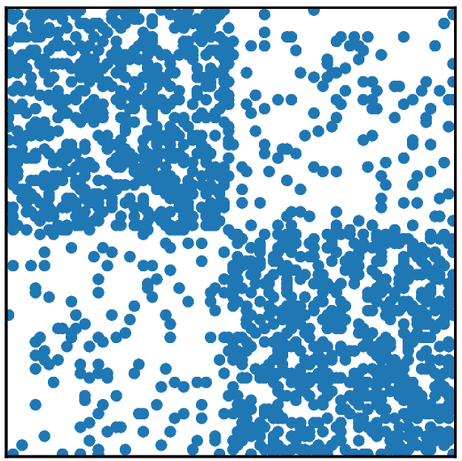
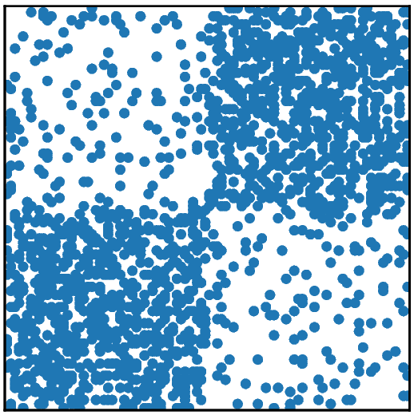
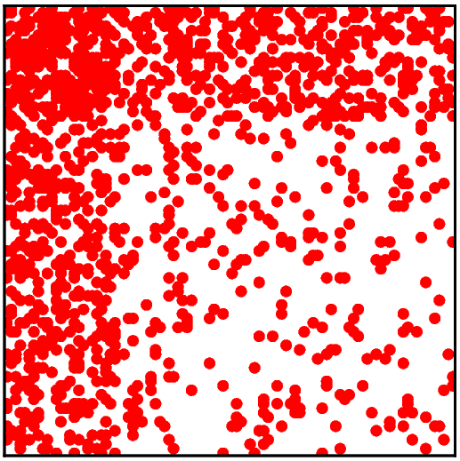

# The core-periphery detection problem

Many such tasks can be viewed in terms of categorizing
nodes or discovering hidden substructures that relate them. 

A relevant problem in network science and data mining is to discover hidden structures in a given network. 
Clustering and  community detection  are perhaps the 
most widely studied such problem, and it forms the basis of many classification algorithms
[@BLSZ18]. Other relevant problems include the anti-community detection problem and the core-periphery one, which we discuss next.

  

In core-periphery detection we seek a set of nodes that are highly connected internally and with the rest of the network, forming the *core*, and a set of *peripheral* nodes that are strongly connected to the core but have only sparse internal connections. 

This kind of structure is important for a number of reasons. For example, identifying core-periphery structures can help in identifying and categorizing hubs, i.e.,  well-connected nodes. As noted in [@rombach2014core], such nodes often occur in real-world networks. This is an issue for some community detection methods, as hubs tend to be connected to many different communities and, thus, can be awkward to classify.  Moreover, the set of core nodes can be used to identify internally cohesive subgraphs of highly central nodes. In fact, even though all core nodes typically have high centrality score, not all nodes with high centrality measures belong to the core and it is possible to find sparsely connected subgraphs of central nodes not belonging to the core [@borgatti2000models].

\bibliography
